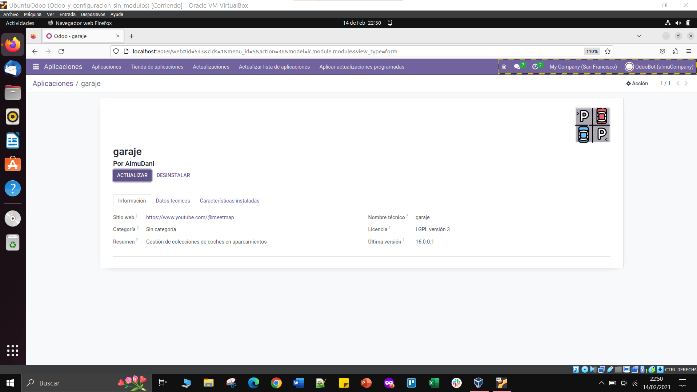

# Práctica de Garaje Odoo

## Resumen general
En esta práctica veremos como hacer un módulo de gestión de un garaje en Odoo Local utilizando los lenguajes XML, Python y CSV. Explicando uno a uno los archivos y sus funcionalidades, y también de manera ordenada en función del orden de edición que hemos seguido.

## Manifest
El archivo [Manifest](./__manifest__.py) nos sirve para editar la información general del módulo, ya sea el autor, descripciones, web propia, etc. pero también en este archivo tenemos que declarar que archivos van a ser utilizados, en nuestro caso por ejemplo creamos el archivo [garaje_security](./security/garaje_security.xml) y este ha de ser declarado en 'data' para poder ser utilizado. El resultado sería algo así:

